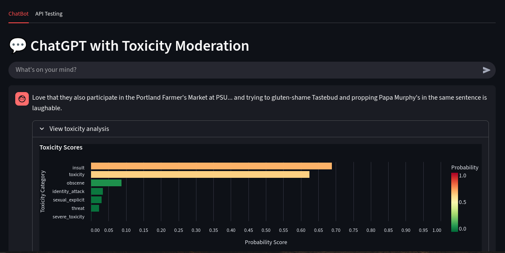
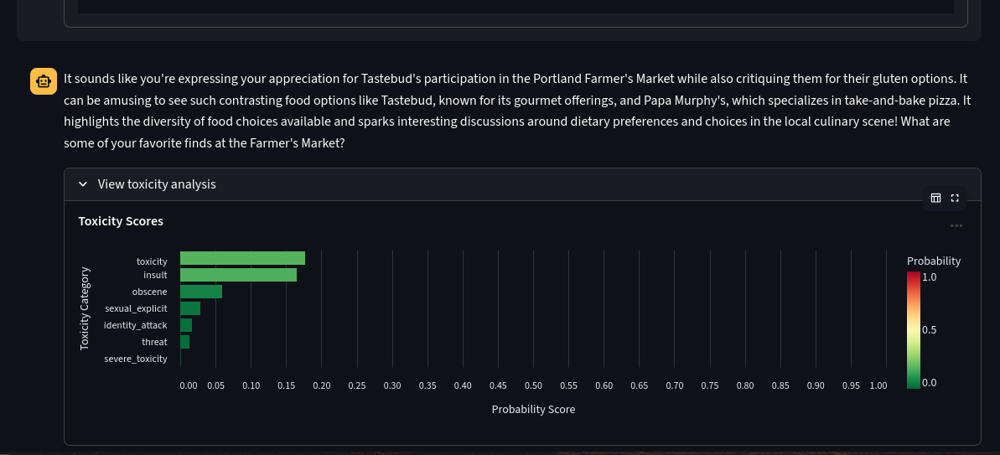
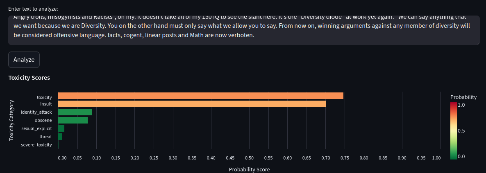

# Solulab AI Safety Models POC

A proof of concept implementation of AI safety models for enhancing user safety in conversational AI platforms. This project implements multiple safety layers including abuse detection, escalation recognition, crisis intervention, and content filtering.

## Features Implemented.
- toxicity 
- severe toxicity
- obscene
- threat
- insult
- identity attack
- sexual explicit

## Project Structure


```
solulab_poc/
├── src/
│   ├── bert.ipynb      # BERT model implementation
│   ├── LR.ipynb      # Logistic Regression models implementation
│   ├── RNNC.ipynb    # RNN Classifier implementation
│   └── inference/
│       └── models/    # Saved model artifacts
│       └── app.py    # streamlit app for inference and chatbot
│       └── requirements.txt    # Python dependencies
│       └── Dockerfile    # Dockerfile for containerization
│       └── main.py    # Entry point for the FastAPI application
├── README.md
└── PROBLEM.md
```


## Models

The project implements two main model architectures:

1. **Logistic Regression Models**
   - Fast, interpretable baseline models
   - TF-IDF vectorization for text processing
   - Separate models for different safety aspects

2. **RNN Classifier**
   - Deep learning approach for complex pattern recognition
   - Better handling of sequential data and context
   - Suitable for escalation detection


## Setup and Installation

1. Clone the repository:
```bash
git clone https://github.com/mani-prakash-reddy/solulab_poc.git
cd solulab_poc
```

2. Create and activate a Python virtual environment:
```bash
python -m venv venv
source venv/bin/activate
```

3. Install dependencies:
```bash
pip install -r src/requirements.txt
```

## Usage

### Running the Notebooks

1. Start Jupyter Lab/Notebook:
```bash
jupyter lab
```

2. Navigate to the `src` directory and open either `LR.ipynb` or `RNNC.ipynb`

### Model Training

The models can be trained using the provided notebooks. The trained models are automatically saved in the `src/inference/models` directory.

### Inference

1. Run the model apis with docker
    - This Containerization allows for easy deployment and scalability of the inference in various environments like local machines for development and testing, cloud platforms (AWS lambda, Google Cloud Functions) and also this will remove the vendor lock-in.
```bash
cd src/inference
docker build -t toxicity-inference .
docker run -d -p 8000:8000 toxicity-inference
```
2. Access the API documentation at `http://localhost:8000/docs` to test the endpoints.
   - `/predict/single` for single text input
   - `/predict/batch` for batch text input
    - Example request payload:
    ```json
    {
         "text": "Your input text here"
    }
    ```
    Single prediction:
    ```bash
    curl -X POST "http://localhost:8000/predict" \
     -H "Content-Type: application/json" \
     -d '{"text": "your text here"}'
     ```

    Batch prediction:
    ```bash
    curl -X POST "http://localhost:8000/predict/batch" \
        -H "Content-Type: application/json" \
        -d '{
            "texts": [
                "your first text here",
                "your second text here"
            ]
        }'
    ```
    The API will return probabilities for each toxicity category we trained models for (toxicity, severe_toxicity, obscene, threat, insult, identity_attack, sexual_explicit).

### Streamlit App
1. Navigate to the `src/inference` directory.
2. Run the Streamlit app:
```bash
streamlit run app.py
```
3. Access the app at `http://localhost:8501` to interact with the toxicity classifier and chatbot.
4. Make sure your environment variable is set for OpenAI API key
    - This is required for the chatbot functionality to interact with OpenAI's API. Without this our classifier still works fine.
```bash
export OPENAI_API_KEY='your_openai_api_key'
```
api interaction with real-time chatbot


ui for toxicity classification 
